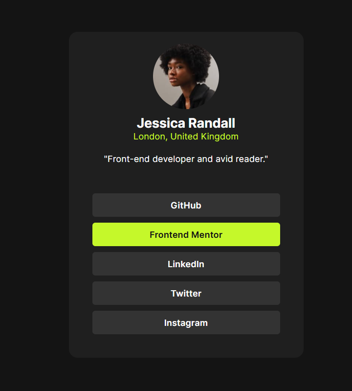

# Frontend Mentor - Social links profile solution

This is a solution to the [Social links profile challenge on Frontend Mentor](https://www.frontendmentor.io/challenges/social-links-profile-UG32l9m6dQ). Frontend Mentor challenges help you improve your coding skills by building realistic projects. 

## Table of contents

- [Overview](#overview)
  - [The challenge](#the-challenge)
  - [Screenshot](#screenshot)
  - [Links](#links)
- [My process](#my-process)
  - [Built with](#built-with)
  - [What I learned](#what-i-learned)
  - [Continued development](#continued-development)
  - [Useful resources](#useful-resources)

## Overview

### The challenge

Users should be able to:

- See hover and focus states for all interactive elements on the page

### Screenshot

### Links

- Solution URL: [Code](https://github.com/SimonMcCaffery/social-links-profile-main)
- Live Site URL: [Live Site](https://simonmccaffery.github.io/social-links-profile-main/)

## My process

### Built with

- Semantic HTML5 markup
- CSS custom properties
- Flexbox
- CSS Grid

### What I learned

Lightbulb moment that I was not adjusting the width of the component at smaller screen sizes causing it to look incredibly squashed.

Used my first media query, all be it very simply, was still an achievment.

### Continued development

Further use of media queries at different breakpoints to enchance responsivness.

Developing for mobile devices first 

ux principles for sizing at smaller screen sizes

### Useful resources

W3Schools for simple examples of media queries that were easy to understand and create my own.
